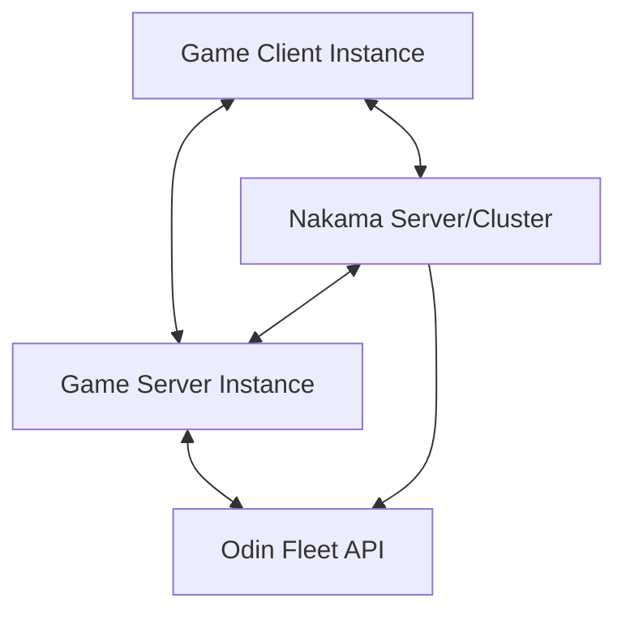
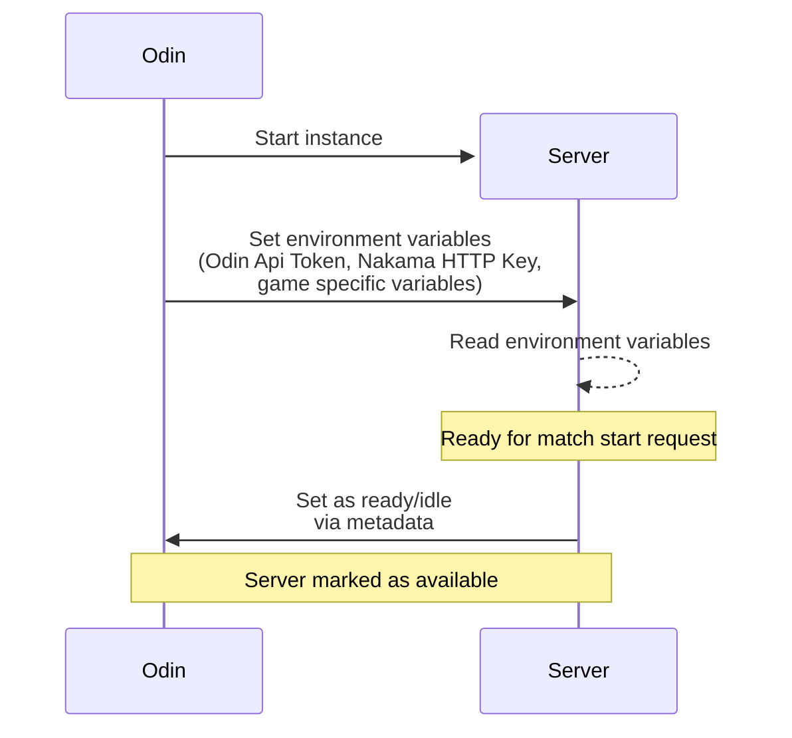
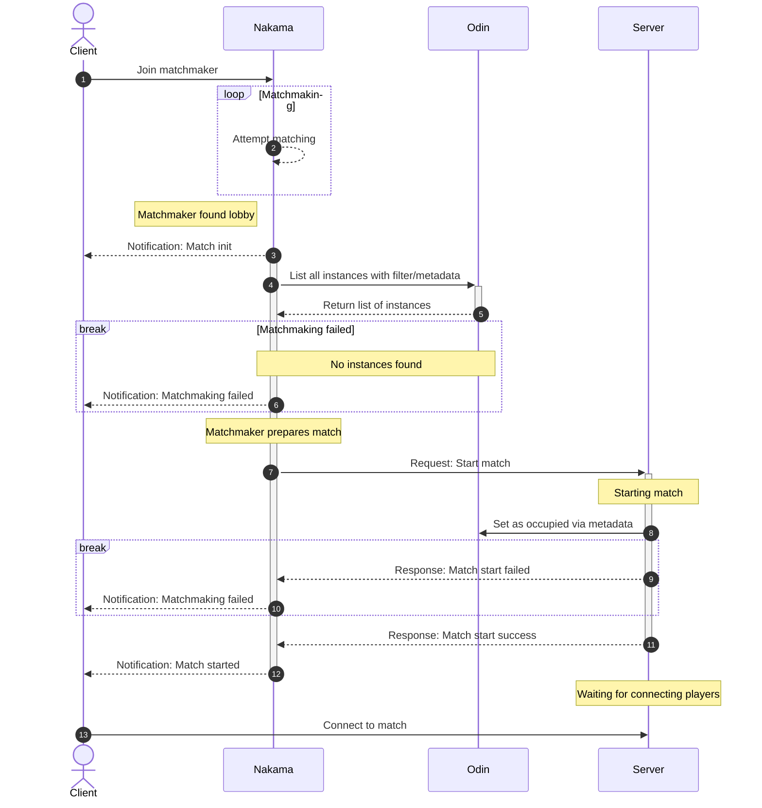
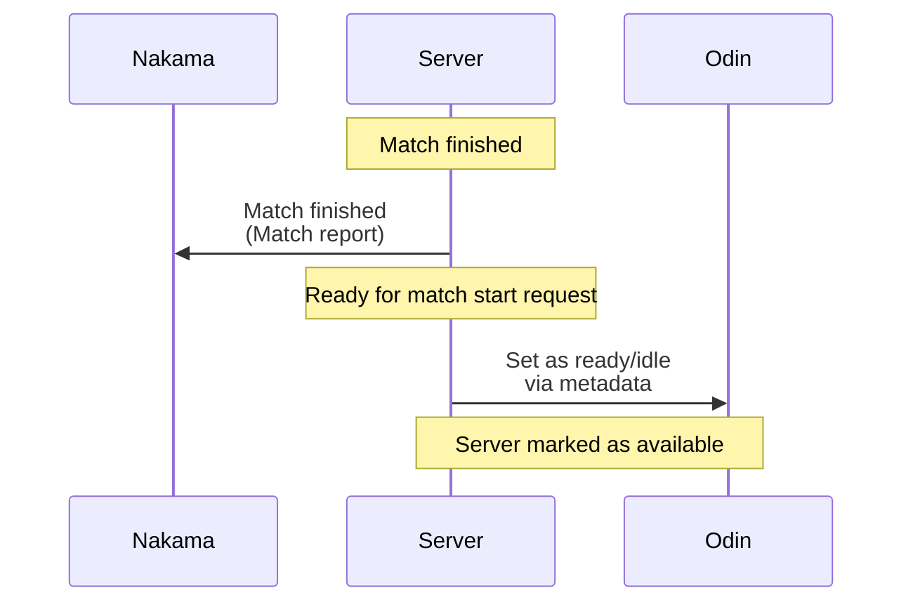

# Odin Fleet Manager for Nakama

Notes:
- the `./api` folder includes the bindings for the Odin API generated by `open-api-generator-cli`
- Global consts `AppId` and `Token` (inside `odinfleet_bindings_test.go`) must be set in order for tests for work 

## Setup

### Game client
- Nakama SDK
  - Send matchmaker join requests
  - Receive matchmaker notifications
### Game server
- Access to environment variables set by Odin
  - Odin Api Token
  - Nakama HTTP Key (required for server to server communication)
- Method to access Odin Fleet API
  - via some SDK (Odin SDK)
  - OR Open Api generator bindings or HTTP client
- Nakama SDK
  - Server-to-server RPC communication with nakama backend
  - Server-to-client socket communication for matchmaker notifications
### Nakama
- Method to access Odin Fleet API
  - This package
  - OR Open Api generator bindings or HTTP client

We also use protobuf to ensure a consistent data format between all participants. For example, our fleet metadata is encoded as a protobuf
message and converted into json for the Odin API. However, this is purely optional.

## Infrastructure


## Usage

### Game server initialization



When the fleet manager starts a game server instance, the server extracts the Odin Api Token and HTTP Runtime Key from the environment. 
Additionally, game specific settings are applied based on environment variables when defined. 
<br>After that, the server sets its instance metadata via Odin Fleet Api to appear as ready/idle to the matchmaker, for example: <br>
```json
{
  "instance_state": "idle"
}
```

### Matchmaking

This diagram shows the matchmaking process from start to end



In order to start the matchmaking process the client joins the matchmaker pool and is assigned a ticket.
Once the nakama matchmaker finds a lobby for a set of users, match initialization notifications are sent to the matched users (3).

Then the Odin API is queried for all suitable instances by filtering for location and metadata properties (4,5).
If no instance is found, all matched users get notified and the matchmaking process is aborted (6).

If available instances exist, nakama selects one at random and sends a _start match_ request to that instance (7). 
The game server then initializes the match and sets its metadata via the Odin Fleet API (8). This marks the server as unavailable to the matchmaker, hosting a running match<br>
For example (simplified):
```json
{
    "instance_state": "occupied" // State of match <idle|occupied>
    "match_id": "<match_id>",
    "game_mode": "DEATH_MATCH",
    "map_guid": "<map_id>",
    "join_mode": "whitelist" // Who can join? <whitelist|free>
    "user_ids": [
        "<player_id>",
        "<player_id>"
      ]
}
```

Once the match has started, the server is ready to receive connecting players. It then sends either a failure (9) or success (11) response back to nakama. 
Nakama notifies all matched users of the result (10,12). If successful, the client can attempt to connect to the game server instance (13), joining the match.


### Server match finish/teardown



The stop/teardown process is similar to the instance initialization process. 
When stopping a match, the server sends a match report to nakama first, and then sets the instance metadata, so that it is shown as available to the matchmaker again


## Feature comparison

| Nakama Fleet Manager interface            | Odin fleet API  | Comment                                                                                                                                                                                                    |
|-------------------------------------------|-----------------|------------------------------------------------------------------------------------------------------------------------------------------------------------------------------------------------------------|
| `Get`: Get specific instance              | `GetServerById` |                                                                                                                                                                                                            |
| `List` List instances, by query           | `GetServers`    | AWS Gameslift implementation caches active instance in Database storage and synchronizes with its API every n seconds,<br> this Odin Fleet manager implementation currently fetches instance list from API |
| `Create` Create instance, retrieve its id | No equivalent   | Odin API has currently no defined way to create a server instance and then retrieving its data                                                                                                             |
| `Delete` Delete server instance by id     | No equivalent   | Odin API has currently no defined way to delete a specific server instance                                                                                                                                 |

## Example Nakama integration

This example registers the ODIN fleet manager in a Nakama Go module and reads required config from environment variables:

```go
// examples/nakama_module.go
package main

import (
	"context"
	"database/sql"
	"errors"
	"os"
	"strconv"

	odinfleet "odinfleet-nakama"

	"github.com/heroiclabs/nakama-common/runtime"
)

func InitModule(ctx context.Context, logger runtime.Logger, db *sql.DB, nk runtime.NakamaModule, initializer runtime.Initializer) error {
	appIDRaw := os.Getenv("ODIN_APP_ID")
	if appIDRaw == "" {
		return errors.New("missing ODIN_APP_ID")
	}
	appID, err := strconv.Atoi(appIDRaw)
	if err != nil {
		return err
	}
	apiToken := os.Getenv("ODIN_API_TOKEN")
	if apiToken == "" {
		return errors.New("missing ODIN_API_TOKEN")
	}

	cfg := odinfleet.GetDefaultConfiguration(int32(appID), apiToken)
	fm, err := odinfleet.CreateOdinFleetManager(logger, cfg, odinfleet.ServerToInstanceInfo)
	if err != nil {
		return err
	}

	if err := initializer.RegisterFleetManager(fm); err != nil {
		return err
	}
	logger.Info("ODIN fleet manager registered")
	return nil
}
```

Notes:
- `ServerToInstanceInfo` expects the server metadata to include a `game_port` entry; if your metadata uses another key, provide a custom converter and pass it into `CreateOdinFleetManager`.
- Set `ODIN_APP_ID` and `ODIN_API_TOKEN` in the Nakama runtime environment before startup.

## Example mock game server

A minimal HTTP mock game server is available at `examples/mock_game_server.go`. It marks itself as ready on startup and exposes:
- `POST /match/start` to set `instance_state=occupied` and attach match metadata.
- `POST /match/finish` to reset to `instance_state=idle`.
- `GET /health` for liveness checks.

Required environment variables:
- `ODIN_API_TOKEN` - Odin API token.
- `ODIN_SERVICE_ID` - service/instance ID to update metadata for.
- `ODIN_GAME_PORT` - optional, defaults to `7777`.
- `MOCK_SERVER_ADDR` - optional, defaults to `:8080`.
